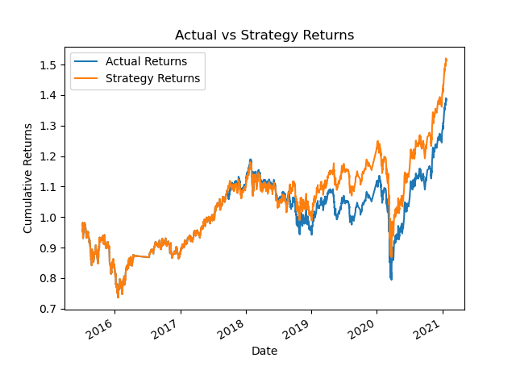
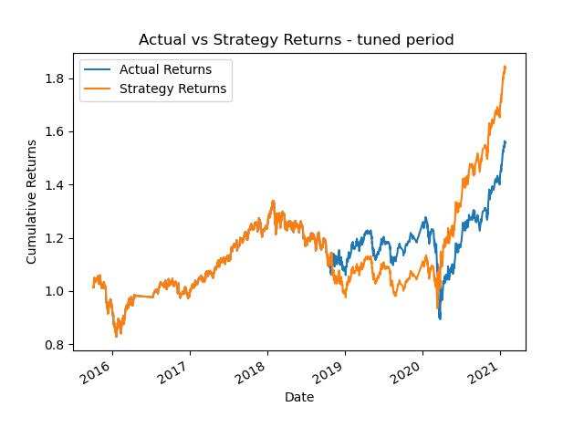
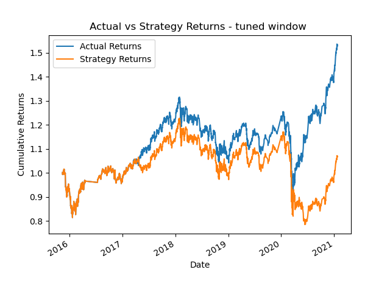
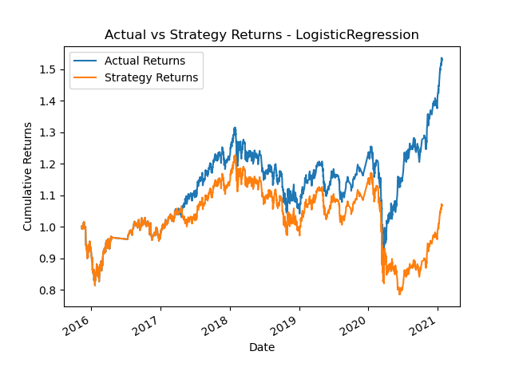

# Machine Learning Trading Bot

## Overview
The purpose of this challenge is to improve the existing algorithmic trading systems and maintain the firm’s competitive advantage in the market. To do so, determine which model was the most effective at predicting stock returns for the given dataset.
We can get OHLCV dataset from Quandl and use it to complete the follow steps:

* Establish a Baseline Performance 
   - using the `SVC` classifier model
* Tune the Baseline Trading Algorithm 
   - increase the size of the training dataset
   - increase both the short-window and long-window for the algorithm
* Evaluate a New Machine Learning Classifier
   - LogisticRegression
* Create an Evaluation Report
   - support findings by the classification report and the PNG image saved
   
## Installation

This project leverages Python 3.9 with the following packages:

+ pandas
+ numpy
+ hvplot
+ scikit-learn
+ matplotlib

### Installation Guide(MacOS & Windows)

1.  Open a terminal or command prompt on your computer.
2.  Install all packages by running the commands: 

```bash
  pip install pandas 
  pip install numpy
  pip install scikit-learn
  pip install matplotlib
  pip install hvplot
```

## Results

This challenge compared the 4 performances of two machine learning models by analyzing the classification reports and visualizing the actual vs strategy returns plots. Here are the results.

**Baseline Performance using the `SVC` classifier model:**

               precision    recall  f1-score   support

        -1.0       0.43      0.04      0.07      1804
         1.0       0.56      0.96      0.71      2288

    accuracy                           0.55      4092
    

  * The accuracy score for the SVC model is 0.55, meaning that the model correctly predicted the direction of the stock price movement for 55% of the test dataset.

  * The precision is 0.43 for the −1 class and 0.56 for the 1 class. The recall is 0.04 for the −1 class and 0.96 for the 1 class. Based on the much higher recall, the model is better at predicting the 1 class than the −1 class.
 


  * According to the plot, the SVM model performed well from the beginning of the period until late in 2018. That’s when the actual and predicted returns start to differ. The SVM model made strategy returns that slightly outperformed the actual returns from 2019 to 2021. Overall, the SVM model produced a slightly higher cumulative return value than the actual returns.

**Tune the Baseline Trading Algorithm by enlarging the size of the training dataset:**
                 
                precision    recall  f1-score   support

        -1.0       0.44      0.02      0.04      1732
         1.0       0.56      0.98      0.71      2211

    accuracy                           0.56      3943
   

  For the tuned algorithm with a larger training dataset, we can see that 
  * the accuracy has slightly increased to 0.56 compared to the baseline SVC model. 
  * The precision is 0.44 for the −1 class and 0.56 for the 1 class, which is similar to the baseline model. 
  * However, the recall has increased significantly to 0.02 for the −1 class and 0.98 for the 1 class. This means that the tuned algorithm is much better at predicting the 1 class than the baseline model.
  


  * According to the plot, after enlarge the size of the dataset, the SVM model performed really well from the beginning of the period until late in 2018. But from late 2018 to early 2020, the SVM model made strategy returns slightly underperformed the actual returns. Then from early 2020 to the end of the peoriod, the SVM model made strategy returns outperformed the actual returns.  Overall, the SVM model produced a higher cumulative return value after expand the size of the dataset.
  
  * Comparing the 2 plots, we can get a conclusion that tuning the training algorithm by increasing the size of the training dataset from 3 months to 6 months best improved the trading algorithm returns since it could make a higher cumulative returns of the strategy returns.
  
  
**Tune the Baseline Trading Algorithm by increasing both short window and long window:**

                precision    recall  f1-score   support

        -1.0       0.38      0.05      0.09      1694
         1.0       0.56      0.94      0.70      2162

    accuracy                           0.55      3856
    
  
  For the tuned algorithm with larger short window and long window, we can see that 
  * The precision is 0.38 for the −1 class and 0.56 for the 1 class. The recall is 0.05 for the −1 class and 0.94 for the 1 class. Based on the much higher recall, the model is better at predicting the 1 class than the −1 class.

  * Compared to the previous tuning, increasing both the short window and long window did not improve the overall performance of the algorithm, as the accuracy remained at 0.55, but the precision for the −1 class decreased slightly from 0.44 to 0.38.
  
  * Compared to the baseline performance of the SVC model, both tuned versions of the trading algorithm resulted in slightly higher accuracy scores, with the second tuning (increasing both short and long window) achieving the highest accuracy score of 0.55. However, the precision and recall scores for the negative class (-1) were still very low, indicating that the model is still not very effective at predicting when the stock price will decrease. Overall, the tuned versions of the trading algorithm showed some improvement over the baseline performance, but there is still room for further optimization.



  * According to the plot, after increase both short window and long window, the SVM model performed well at the beginning of the period until ealy in 2017. Then the SVM model made strategy returns underperformed the actual returns, especially  Then from early  to the end of the peoriod, the SVM model made strategy after early 2020, the strategy returns became pretty lower than actual returns.
  
**Apply original parameters to a second machine learning model - LogisticRegression:**

               precision    recall  f1-score   support

        -1.0       0.44      0.33      0.38      1804
         1.0       0.56      0.66      0.61      2288

    accuracy                           0.52      4092
    
  * The performance of the LogisticRegression model is worse than the Baseline SVC model. The accuracy score is lower, at 0.52 compared to 0.55 for the Baseline SVC model. The precision and recall scores for both the -1 and 1 classes are also lower for the Logistic Regression model, indicating that it is less effective at predicting both price movements.



   * According to the plot, the LogisticRegression model performed even worse than either the baseline SVC model or the tuned period version. It performed same as the tuned windows version, making they two became the worst amount the four. At the beginning of the period it performed well until ealy in 2017. Then the model made strategy returns underperformed the actual returns, especially from early 2020 to the end of the peoriod, the strategy returns became pretty lower than actual returns.

  
## Summary

By increasing the size of the training dataset from 3 months to 6 months, we were able to train the SVC model on more data and potentially capture more patterns in the data. This led to a highest cumulative return of the strategy returns, indicating that the model was better than others at making profitable trades.


## Contributor
* Demi Gao
---

## License
This program is licensed under the MIT License.